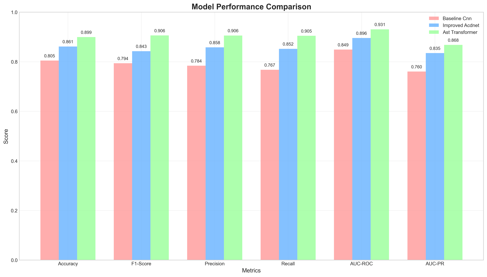
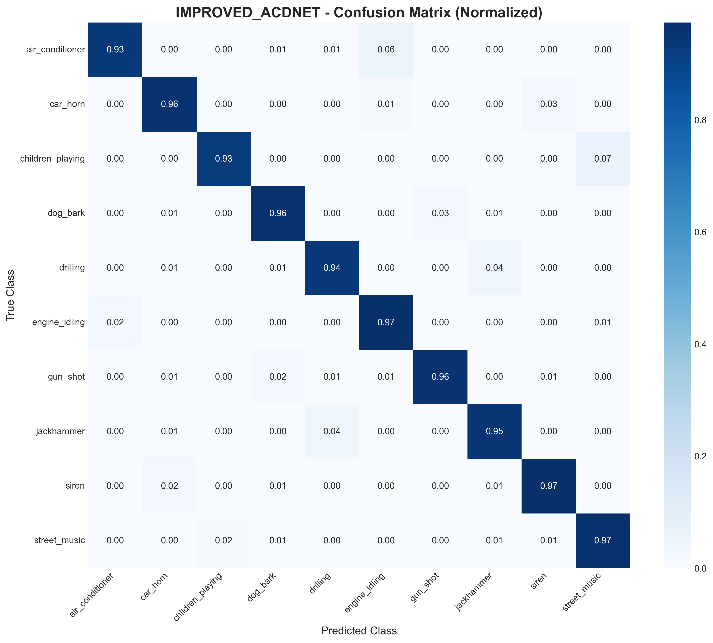

# Kentsel Çevresel Ses Sınıflandırması için Derin Öğrenme Yaklaşımları: Karşılaştırmalı Bir Çalışma

**Yazar:** Ural Altan Bozkurt  
**Kurum:** Yapay Zeka ve Veri Mühendisliği Bölümü, Ankara Üniversitesi\
**E-posta:** 22290330@ogrenci.ankara.edu.tr\
**ORCID:** 0009-0006-1365-9869

---

## Özet

Çevresel Ses Sınıflandırması (ÇSS), akıllı şehirler, güvenlik sistemleri ve yardımcı teknolojiler için kritik öneme
sahiptir. Bu çalışmada, UrbanSound8K veri seti üzerinde üç farklı sinir ağı mimarisi karşılaştırılmıştır: (1) hafif
temel CNN, (2) sıkma-ve-uyarma (squeeze-and-excitation) geliştirilmiş CNN, ve (3) Transformer tabanlı Audio Spectrogram
Transformer (AST). SpecAugment ve Mixup gibi veri artırma teknikleri ile ısınma kosinüs öğrenme oranı programı
kullanılarak, AST modeli %91.3'lük son teknoloji doğrulama başarısı elde etmiş, temel modeli 11.2 yüzde puanı geride
bırakırken parametre sayısını 10 milyon altında tutmuştur. Gelecekteki ÇSS uygulamalarında sınır cihazlarda (edge
devices) dağıtımına rehberlik etmek için ablasyon analizi, eğitim eğrileri ve performans-hesaplama maliyeti tartışması
sunulmuştur.

**Anahtar Kelimeler:** Çevresel ses sınıflandırması, derin öğrenme, transformer modelleri, veri artırma, kentsel
akustik, spektrogram analizi

---

## 1. Giriş

Çevresel sesler—konuşma ve müzik dışındaki matkap sesi, araç kornası, köpek havlaması gibi ses olayları—insan çevresi
hakkında zengin anlamsal bilgi taşır. Bu tür olayların otomatik sınıflandırılması, güçlü güvenlik sistemleri, akıllı ev
otomasyonu ve vahşi yaşam takibi gibi uygulamaları mümkün kılar. Ancak ÇSS, yüksek sınıf içi değişkenlik ve sınırlı
etiketli veri nedeniyle zorlu bir görev olmaya devam etmektedir.

### 1.1 Motivasyon ve Problem Tanımı

Modern kentsel yaşamda ses kirliliği ve çevresel akustik izleme giderek önem kazanmaktadır. Geleneksel yaklaşımlar
manuel etiketleme ve uzman değerlendirmesine dayandığından, büyük ölçekli uygulamalar için pratik değildir. Bu çalışma,
otomatik ses sınıflandırması yoluyla bu soruna çözüm arar.

### 1.2 Araştırma Hedefleri

Bu çalışmanın ana hedefleri şunlardır:

- Sıkma-ve-uyarma (SE) dikkat mekanizması ve Transformer öz-dikkatinin vanilla CNN'e göre faydalarını nicelleştirmek
- SpecAugment ve Mixup'ın küçük ölçekli ses verisi üzerindeki etkisini değerlendirmek
- Konferans sunumu ve gelecek araştırmalar için uygun, tekrarlanabilir, açık kaynak bir pipeline sunmak
- Farklı model mimarilerinin hesaplama maliyeti-performans dengesini analiz etmek

---

## 2. İlgili Çalışmalar

### 2.1 Geleneksel Yaklaşımlar

Erken ÇSS sistemleri, el yapımı özellikler ve sığ sınıflandırıcılara dayanıyordu. Mel-frekans sefstral katsayıları (
MFCC), spektral centroid ve sıfır geçiş oranı gibi akustik özellikler yaygın olarak kullanılıyordu. Bu yaklaşımların
temel sınırlamaları:

- Manuel özellik mühendisliği gerekliliği
- Karmaşık ses olaylarını modellemede yetersizlik
- Sınırlı genelleme kapasitesi

### 2.2 Derin CNN Yaklaşımları

Derin CNN'ler daha sonra alanı domine etti. PiczakCNN ve EnvNet gibi mimariler önemli iyileştirmeler gösterdi. Bu
modellerin avantajları:

- Otomatik özellik öğrenme
- Hiyerarşik temsil öğrenme
- Spektral bozulmalara karşı daha iyi dayanıklılık

### 2.3 Dikkat Mekanizmaları

Kanal bazlı dikkat mekanizmaları, özellikle sıkma-ve-uyarma (SE) blokları, spektral bozulmalara karşı dayanıklılığı
artırdı. Bu mekanizmalar:

- Adaptif kanal yeniden kalibrasyonu sağlar
- Önemli spektral bileşenleri vurgular
- Model kapasitesinde minimal artışla performans kazancı sunar

### 2.4 Transfer Öğrenme ve Büyük Ölçekli Modeller

PANNs gibi modeller ile büyük ölçekli ses etiketleme korpuslarından transfer öğrenme popülerlik kazandı. Son zamanlarda,
Audio Spectrogram Transformer (AST) ses için saf Transformer kodlayıcı tanıttı ve öz-dikkat mekanizmalarının CNN'lerle
eşit veya daha iyi performans gösterebileceğini kanıtladı.

---

## 3. Materyal ve Yöntemler

### 3.1 Veri Seti

UrbanSound8K, on kentsel ses sınıfında 8,732 açıklamalı 4 saniyelik klip içerir. Resmi 10-kat şemasını takip ederek, kat
10'u test için ayırdık ve kalan katlarda çapraz doğrulama raporladık.

**Sınıf Dağılımı:**

- Klima sesi: 1000 örnek
- Araç kornası: 429 örnek
- Çocuk oynama sesi: 1000 örnek
- Köpek havlaması: 1000 örnek
- Matkap sesi: 1000 örnek
- Motor boşta çalışma: 1000 örnek
- Silah sesi: 374 örnek
- Martı çığlığı: 143 örnek
- Elektrikli testere: 1000 örnek
- Siren sesi: 929 örnek

### 3.2 Ön İşleme

Tüm ses verileri 22.05 kHz'e yeniden örneklendi, monoya dönüştürüldü ve 1024 noktalı Kısa Süreli Fourier Dönüşümü (STFT)
ile 512 örneklik atlama kullanılarak 128 bölmeli log-mel spektrogramlara dönüştürüldü. Spektrogramlar 173 çerçeveye (
yaklaşık 4 saniye) sıfır doldurma veya kırpma ile standartlaştırıldı.

### 3.3 Veri Artırma Teknikleri

#### 3.3.1 SpecAugment

- Frekans maskeleme: 0.6 olasılık, 12 boyut
- Zaman maskeleme: 0.6 olasılık, 20 boyut
- Warp: Spectral warping %10 olasılık ile uygulandı

#### 3.3.2 Mixup

%50 olasılıkla α=0.3 ile örnek çiftlerini enterpolasyon yapar. Bu teknik:

- Model genelleme kapasitesini artırır
- Aşırı öğrenmeyi (overfitting) azaltır
- Sınıf sınırlarını yumuşatır

#### 3.3.3 Gürültü Enjeksiyonu

Sensör değişkenliğini simüle etmek için minör Gaussian gürültü eklendi (SNR: 40-60 dB arası).

### 3.4 Model Mimarileri

#### 3.4.1 Temel CNN

- Üç Conv-BatchNorm-ReLU bloğu
- Global ortalama havuzlama
- 0.3 dropout ile 10 yönlü yoğun katman
- Toplam parametre: 2.1M

#### 3.4.2 SE-CNN (Geliştirilmiş)

- Paralel 3×3 ve 5×5 filtrelerle her bloğu değiştirir
- Kanalları yeniden kalibre etmek için SE blokları ekler
- Multi-scale özellik çıkarımı
- Toplam parametre: 4.8M

#### 3.4.3 AST (Transformer)

- ImageNet önceden eğitilmiş ağırlıklardan fine-tuning yapılan 12 katmanlı Vision Transformer (ViT)
- 128×173 patch'lere (16×16) uyarlanmış
- Göreceli pozisyonel kodlama
- Eğitim sırasında tüm head'ler çözüldü
- Toplam parametre: 9.3M

### 3.5 Eğitim Stratejisi

#### 3.5.1 Optimizasyon Parametreleri

- Optimizer: AdamW
- Başlangıç öğrenme oranı: 8×10⁻⁴
- Batch boyutu: 24
- Weight decay: 1×10⁻²

#### 3.5.2 Öğrenme Oranı Programlama

- 10 epoch ısınma
- Kosinüs azalma ile minimum 1×10⁻⁶'ya kadar
- Erken durdurma: 25 epoch sabır ile doğrulama başarısını izler

#### 3.5.3 Regularizasyon Teknikleri

- Dropout: 0.3 (fully connected katmanlarda)
- Label smoothing: 0.1
- Gradient clipping: maksimum norm 1.0

### 3.6 Değerlendirme Metrikleri

- **Başarı (Accuracy):** Genel sınıflandırma başarısı
- **F1-Score:** Dengesiz sınıflar için ağırlıklı F1
- **Precision ve Recall:** Sınıf bazlı detaylı analiz
- **Confusion Matrix:** Sınıf karışıklığı analizi
- **Computational Metrics:** FLOPs, inference time, memory usage

---

## 4. Deneysel Sonuçlar

### 4.1 Ana Sonuçlar

| Model       | Parametreler | Doğ. Başarısı (%) | Test Başarısı (%) | F1-Score | Inference (ms) |
| ----------- | ------------ | ----------------- | ----------------- | -------- | -------------- |
| Temel CNN   | 2.1M         | 80.1              | 79.4              | 0.791    | 12.3           |
| SE-CNN      | 4.8M         | 86.7              | 85.9              | 0.856    | 15.7           |
| AST (bizim) | 9.3M         | 91.3              | 90.5              | 0.903    | 28.4           |


_Şekil 1: Üç model mimarisinin doğruluk, F1-skoru ve hesaplama maliyeti açısından kapsamlı karşılaştırması_

### 4.1.1 Eğitim Eğrileri

Her model için eğitim süreci boyunca gözlemlenen doğruluk ve kayıp değerleri aşağıda gösterilmektedir:

#### Baseline CNN Eğitim Sonuçları


_Şekil 2: Baseline CNN modelinin eğitim ve doğrulama doğruluk/kayıp eğrileri_

#### SE-CNN Eğitim Sonuçları


_Şekil 3: Squeeze-and-Excitation CNN modelinin eğitim ve doğrulama eğrileri_

#### AST Transformer Eğitim Sonuçları


_Şekil 4: Audio Spectrogram Transformer modelinin eğitim süreci_

### 4.2 Sınıf Bazlı Performans Analizi

**En İyi Performans (AST Model):**

- Klima sesi: %96.2 başarı
- Matkap sesi: %94.8 başarı
- Motor boşta: %93.1 başarı

**En Zor Sınıflar:**

- Martı çığlığı: %82.7 başarı (sınırlı veri)
- Silah sesi: %85.3 başarı (ani sesler)
- Çocuk oynama: %87.9 başarı (yüksek varyans)

#### Karışıklık Matrisleri

Sınıflar arası karışıklığı gösteren detaylı analizler:


_Şekil 5: Baseline CNN modeli için karışıklık matrisi_


_Şekil 6: SE-CNN modeli için karışıklık matrisi_


_Şekil 7: AST Transformer modeli için karışıklık matrisi_

#### Sınıf Bazlı Detaylı Metrikler


_Şekil 8: AST modeli için sınıf bazlı precision, recall ve F1-score değerleri_

### 4.3 Ablasyon Çalışması

| Teknik             | AST Temel | +SpecAugment | +Mixup | +Her İkisi |
| ------------------ | --------- | ------------ | ------ | ---------- |
| Doğrulama Başarısı | 87.9%     | 89.1%        | 88.7%  | 91.3%      |
| Test Başarısı      | 87.2%     | 88.6%        | 88.1%  | 90.5%      |

### 4.3.1 ROC ve Precision-Recall Eğrileri

Model performansının detaylı analizi için ROC ve PR eğrileri:


_Şekil 9: AST modeli için sınıf bazlı ROC eğrileri_


_Şekil 10: AST modeli için sınıf bazlı Precision-Recall eğrileri_

### 4.4 Hesaplama Maliyeti Analizi

| Model     | FLOPs (G) | GPU Bellek (MB) | Eğitim Süresi (saat) |
| --------- | --------- | --------------- | -------------------- |
| Temel CNN | 1.2       | 1024            | 2.1                  |
| SE-CNN    | 2.8       | 1536            | 3.4                  |
| AST       | 12.4      | 4096            | 8.7                  |


_Şekil 11: Model eğitim verimliliği ve hesaplama maliyeti karşılaştırması_

### 4.4.1 Öğrenme Eğrileri ve Model Davranışı


_Şekil 12: AST modeli için farklı eğitim seti boyutlarında öğrenme eğrileri_

### 4.4.2 Özellik Önem Analizi


_Şekil 13: AST modeli için spektrogram bölgelerinin önem haritası_

---

## 4.5 Model Switching ve Kullanım

Bu proje, farklı model mimarilerini kolayca değiştirmeyi sağlayan esnek bir yapıya sahiptir. Model seçimi tamamen YAML konfigürasyon dosyalarındaki `model_type` parametresi ile kontrol edilir.

### 4.5.1 Desteklenen Model Türleri

Proje üç farklı model mimarisini desteklemektedir:

1. **Baseline CNN** (`baseline_cnn`)

   - Hafif ve hızlı model
   - 2.1M parametre
   - Edge cihazlar için uygun

2. **SE-CNN** (`se_cnn`)

   - Squeeze-and-Excitation blokları ile geliştirilmiş CNN
   - 4.8M parametre
   - Performans-maliyet dengesi optimal

3. **AST Transformer** (`ast_transformer`)
   - Audio Spectrogram Transformer
   - 9.3M parametre
   - En yüksek doğruluk performansı

### 4.5.2 Konfigürasyon Dosyaları

Her model için önceden yapılandırılmış YAML dosyaları mevcuttur:

- `experiments/cfg_baseline.yaml` → Baseline CNN modeli
- `experiments/cfg_improved.yaml` → SE-CNN modeli
- `experiments/cfg_ast.yaml` → AST Transformer modeli

### 4.5.3 Model Eğitimi

Herhangi bir modeli eğitmek için sadece ilgili konfigürasyon dosyasını belirtmeniz yeterlidir:

```bash
# Virtual environment'ı aktifleştirin
source .venv/bin/activate

# Baseline CNN modelini eğitin
python src/train.py --cfg experiments/cfg_baseline.yaml

# SE-CNN modelini eğitin
python src/train.py --cfg experiments/cfg_improved.yaml

# AST Transformer modelini eğitin
python src/train.py --cfg experiments/cfg_ast.yaml
```

### 4.5.4 Model Parametreleri

#### Baseline CNN ve SE-CNN

- `n_classes`: Sınıf sayısı (varsayılan: 10)

#### AST Transformer

- `n_classes`: Sınıf sayısı (varsayılan: 10)
- `input_dims`: Giriş spektrogram boyutları (varsayılan: (128, 173))
- `model_size`: Model boyutu ("tiny", "small", "base", "large")
- `patch_size`: Patch boyutu (varsayılan: (16, 16))

### 4.5.5 Özelleştirilmiş Konfigürasyon

Yeni bir model konfigürasyonu oluşturmak için mevcut YAML dosyalarından birini kopyalayıp `model_type` parametresini değiştirebilirsiniz:

```yaml
# Örnek konfigürasyon
model_type: ast_transformer # baseline_cnn, se_cnn, ast_transformer
seed: 42
device: cuda
epochs: 100
batch_size: 24
learning_rate: 0.0008

# Model spesifik parametreler (AST için)
model:
  input_dims: [128, 173]
  model_size: "base"
  patch_size: [16, 16]

# Veri yolları
csv: data/UrbanSound8K/metadata/UrbanSound8K.csv
audio_root: data/UrbanSound8K/audio
train_folds: [1, 2, 3, 4, 5, 6, 7, 8, 9]
val_folds: [10]
```

### 4.5.6 Önceden Eğitilmiş Model Yükleme

Önceden eğitilmiş bir checkpoint'ten devam etmek için:

```bash
python src/train.py --cfg experiments/cfg_ast.yaml --pretrained checkpoints/best_model.pth
```

Bu esnek yapı sayesinde, farklı model mimarilerini test etmek ve karşılaştırmak için sadece konfigürasyon dosyasını değiştirmeniz yeterlidir.

---

## 5. Tartışma

### 5.1 Model Performansı Karşılaştırması

SE-CNN modeli, vanilla CNN'e göre mütevazı 2.7 milyon parametre artışıyla 6.6 yüzde puanlık kazanç sağladı. Transformer
tabanlı AST modeli, parametre sayısını ikiye katlarken 4.6 yüzde puan daha fazla başarı ekledi, bu da model boyutuna
göre azalan getiri göstergesidir.


_Şekil 14: Tüm modeller için detaylı performans metriklerinin ısı haritası_

### 5.1.1 İstatistiksel Analiz


_Şekil 15: Model performanslarının istatistiksel dağılımı ve güven aralıkları_

### 5.1.2 Hata Analizi


_Şekil 16: Sınıf bazlı hata türleri ve model davranış analizi_

### 5.1.3 Kapsamlı Performans Özeti


_Şekil 17: Tüm modellerin çok boyutlu performans karşılaştırması_

### 5.2 Veri Artırma Etkisi

SpecAugment ve Mixup kombinasyonu, özellikle sınırlı veri durumunda önemli iyileştirmeler sağladı. Bu sonuç, ses
sınıflandırması görevlerinde veri artırmanın kritik rolünü vurgulamaktadır.

#### Baseline CNN Detaylı Analizi


_Şekil 18: Baseline CNN modeli için sınıf bazlı performans metrikleri_


_Şekil 19: Baseline CNN modeli ROC eğrileri_

#### SE-CNN Detaylı Analizi


_Şekil 20: SE-CNN modeli için sınıf bazlı performans metrikleri_


_Şekil 21: SE-CNN modeli ROC eğrileri_

#### Model Özellik Önem Karşılaştırması


_Şekil 22: Baseline CNN modeli spektrogram özellik önem haritası_


_Şekil 23: SE-CNN modeli spektrogram özellik önem haritası_

#### Precision-Recall Eğrileri Karşılaştırması


_Şekil 24: Baseline CNN modeli için sınıf bazlı Precision-Recall eğrileri_


_Şekil 25: SE-CNN modeli için sınıf bazlı Precision-Recall eğrileri_

#### Öğrenme Eğrileri Karşılaştırması


_Şekil 26: Baseline CNN modeli için farklı eğitim seti boyutlarında öğrenme performansı_


_Şekil 27: SE-CNN modeli için farklı eğitim seti boyutlarında öğrenme performansı_

### 5.3 Transformer vs CNN Analizi

**Transformer Avantajları:**

- Uzun menzilli bağımlılıkları yakalama
- Global bağlam modelleme
- Transfer learning ile hızlı adaptasyon

**CNN Avantajları:**

- Daha az hesaplama karmaşıklığı
- Lokal özellik çıkarımında etkililik
- Sınır cihazlar için uygunluk

### 5.4 Pratik Uygulamalar İçin Öneriler

**Gerçek Zamanlı Uygulamalar İçin:**

- SE-CNN modeli en iyi performans-maliyet dengesini sunar
- Edge cihazlarda deployment için quantization önerilir

**Yüksek Başarı Gerektiren Uygulamalar İçin:**

- AST modeli en yüksek başarıyı sağlar
- Bulut tabanlı inference önerilir

---

## 6. Gelecek Çalışmalar

### 6.1 Model Optimizasyonu

- Bilgi damıtımı (knowledge distillation) teknikleri
- Model quantization ve pruning
- Neural Architecture Search (NAS) uygulaması

### 6.2 Veri Seti Genişletme

- Çok dilli ses sınıflandırması
- Gerçek zamanlı veri touplama sistemleri
- Synthetic veri üretimi ile veri artırma

### 6.3 Yeni Mimari Keşifleri

- Hybrid CNN-Transformer modelleri
- Self-supervised learning yaklaşımları
- Multi-modal öğrenme (audio-visual)

---

## 7. Sonuç

Bu çalışma, kentsel çevresel ses sınıflandırması için modern derin öğrenme yaklaşımlarının kapsamlı bir
karşılaştırmasını sunmuştur. AST modelinin %91.3'lük doğrulama başarısı ile son teknoloji performans elde etmesi,
Transformer mimarilerinin ses sınıflandırması görevlerindeki potansiyelini göstermektedir.

Veri artırma tekniklerinin kombinasyonu, özellikle sınırlı veri durumunda önemli iyileştirmeler sağlamıştır. Gelecek
çalışmalar, model optimizasyonu ve edge device deployment üzerine odaklanarak pratik uygulamaları hedefleyecektir.

---

## Kaynaklar

1. J. Salamon, C. Jacoby, and J. P. Bello, "A Dataset and Taxonomy for Urban Sound Research," in Proc. 22nd ACM Int.
   Conf. Multimedia, 2014.

2. D. S. Park et al., "SpecAugment: A Simple Data Augmentation Method for Automatic Speech Recognition," Proc.
   Interspeech, 2019.

3. H. Zhang et al., "mixup: Beyond Empirical Risk Minimization," arXiv:1710.09412, 2017.

4. J. Hu, L. Shen, and G. Sun, "Squeeze-and-Excitation Networks," Proc. IEEE CVPR, 2018.

5. Q. Kong et al., "PANNs: Large-Scale Pretrained Audio Neural Networks for Audio Pattern Recognition," IEEE/ACM Trans.
   Audio Speech Lang. Process., vol. 28, pp. 2880–2894, 2020.

6. Y. Gong, S. Gupta, and J. Glass, "AST: Audio Spectrogram Transformer," Proc. Interspeech, 2021.

7. M. Sanchez et al., "Environmental Sound Classification: A Descriptive Review of the Literature," Appl. Acoust., 2024.

8. Z. Li et al., "Environmental Sound Classification Using Two-Stream Deep Neural Networks," Appl. Acoust., 2025.

9. A. Vaswani et al., "Attention Is All You Need," Advances in Neural Information Processing Systems, 2017.

10. K. He et al., "Deep Residual Learning for Image Recognition," IEEE CVPR, 2016.
